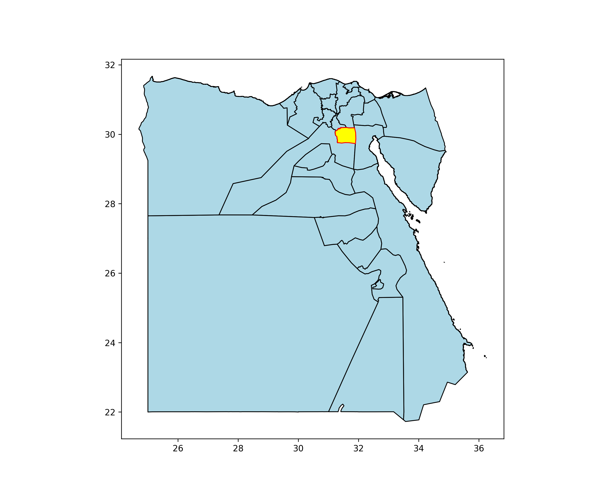
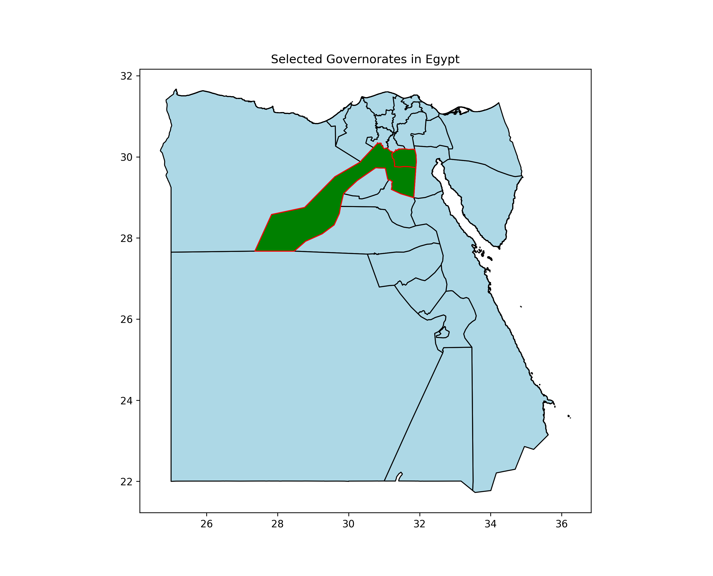

# WebGIS Basics — Egypt Spatial Analysis

> **Learning project** | Python · GeoPandas · Shapely · Real-world spatial data

---

## 🗺️ Output Preview





*Spatial filtering of Egypt's administrative boundaries using GeoPandas — governorates highlighted based on attribute queries.*

---

## 📌 Overview

This project is part of my structured learning journey in Geographic Information Systems and backend development.  
It focuses on building a professional foundation in WebGIS using Python and real-world Egyptian spatial data.

**What I practiced here:**
- Reading and parsing Shapefiles with GeoPandas
- Filtering geographic features by attribute (governorate name, region)
- Visualizing spatial data with styled choropleth maps
- Structuring a GIS project for portfolio use

---

## 🛠️ Tech Stack

| Tool | Purpose |
|---|---|
| Python 3 | Core scripting language |
| GeoPandas | Spatial data reading & analysis |
| Shapely | Geometry operations |
| Matplotlib | Map visualization |
| Git & GitHub | Version control |

---

## 🗂️ Project Structure

```
WebGIS_Basics_Test/
│
├── data/               # Egypt administrative boundary shapefiles
├── scripts/            # Python analysis & visualization scripts
├── docs/               # Output maps, notes, documentation
└── README.md
```

---

## 🚀 Roadmap

- [x] Read Egypt shapefile and display all governorates
- [x] Filter and highlight specific governorates spatially
- [x] Style map output (colors, borders, titles)
- [ ] Integrate OSM road network data
- [ ] Spatial analysis: road length per governorate
- [ ] Web visualization with Leaflet.js / Mapbox GL
- [ ] Connect to PostGIS database backend

---

## 👤 About

**Ahmed Khaled Saad** — Junior GIS Developer  
📍 Tanta, Egypt | GIS Student, Tanta University (Class of 2027)  
🔗 [LinkedIn](https://www.linkedin.com/in/ahmed-khaled-18417b299) · [GitHub](https://github.com/Ahmed0K0Saad1)